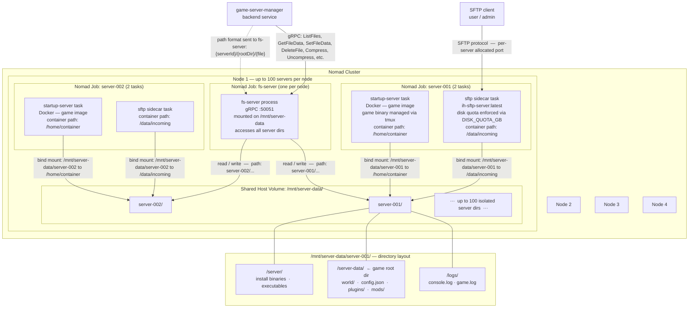

# Iceline Hosting

### 1. Servers Getting Deployed On Node, Fs-Server Deployed On Node ( Both Using Mounts To Point Same Files )

```mermaid

  graph TB
      subgraph CLUSTER["Nomad Cluster"]

          subgraph NODE1["Node 1  —  up to 100 servers per node"]

              subgraph HOSTVOL["Shared Host Volume: /mnt/server-data/"]
                  S001["server-001/"]
                  S002["server-002/"]
                  SMORE["···  up to 100 isolated server dirs  ···"]
              end

              subgraph FSJOB["Nomad Job: fs-server  (one per node)"]
                  FSP["fs-server process<br/>gRPC :50051<br/>mounted on /mnt/server-data<br/>accesses all server dirs"]
              end

              subgraph JOB1["Nomad Job: server-001  (2 tasks)"]
                  G1["startup-server task<br/>Docker — game image<br/>game binary managed via tmux<br/>container path: /home/container"]
                  SFTP1["sftp sidecar task<br/>ih-sftp-server:latest<br/>disk quota enforced via DISK_QUOTA_GB<br/>container path: /data/incoming"]
              end

              subgraph JOB2["Nomad Job: server-002  (2 tasks)"]
                  G2["startup-server task<br/>Docker — game image<br/>container path: /home/container"]
                  SFTP2["sftp sidecar task<br/>container path: /data/incoming"]
              end

          end

          N2["Node 2"]
          N3["Node 3"]
          N4["Node 4"]
      end

      subgraph S001LAYOUT["/mnt/server-data/server-001/  —  directory layout"]
          D_LOGS["/logs/<br/>console.log  ·  game.log"]
          D_SDATA["/server-data/  ← game root dir<br/>world/  ·  config.json  ·  plugins/  ·  mods/"]
          D_SDIR["/server/<br/>install binaries  ·  executables"]
      end

      GSM["game-server-manager<br/>backend service"]
      SFTPCL["SFTP client<br/>user / admin"]

      G1     -->|"bind mount: /mnt/server-data/server-001 to /home/container"| S001
      SFTP1  -->|"bind mount: /mnt/server-data/server-001 to /data/incoming"| S001
      G2     -->|"bind mount: /mnt/server-data/server-002 to /home/container"| S002
      SFTP2  -->|"bind mount: /mnt/server-data/server-002 to /data/incoming"| S002

      S001 --- D_LOGS
      S001 --- D_SDATA
      S001 --- D_SDIR

      FSP -->|"read / write  —  path: server-001/..."| S001
      FSP -->|"read / write  —  path: server-002/..."| S002

      GSM -->|"gRPC: ListFiles, GetFileData, SetFileData, DeleteFile, Compress, Uncompress, etc."| FSP
      GSM -.->|"path format sent to fs-server: {serverId}/{rootDir}/{file}"| FSP
      SFTPCL -->|"SFTP protocol  —  per-server allocated port"| SFTP1

```
